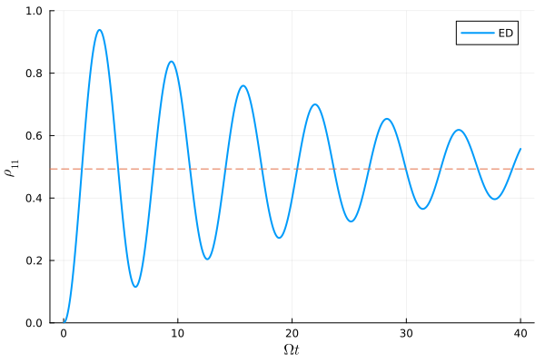
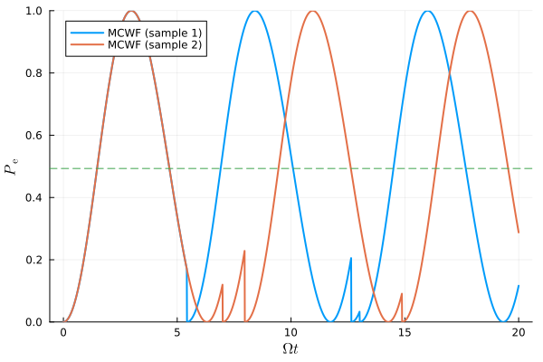
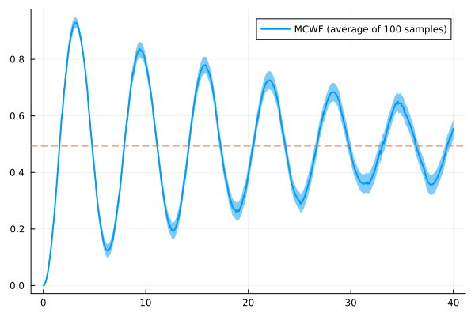
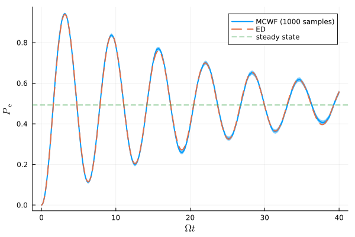

# Quantum System Simulation using MCWF Method

This project implements numerical simulations of open quantum systems using two different approaches:
- Monte Carlo Wave Function (MCWF) method
- Exact Diagonalization (ED) method

## Overview

The project focuses on simulating open quantum systems, where quantum systems interact with their environment, leading to dissipation and decoherence. We compare the results from both MCWF and ED methods to study the dynamics of these systems. The MCWF method provides a stochastic approach to quantum dynamics, particularly useful for open quantum systems, while ED offers an exact solution for benchmarking.

### Key Features
- Implementation of MCWF method for open quantum systems with dissipation
- Exact diagonalization for benchmarking and validation
- Visualization of quantum trajectories and ensemble averages
- Comparison between stochastic and exact methods
- Study of decoherence and dissipation effects in quantum systems

## Project Structure

```
.
├── src/           # Main source code
│   ├── MCWF.jl    # MCWF method implementation
│   ├── ED.jl      # ED method implementation
│   └── model.jl   # Model definition
├── examples/      # Usage examples
│   ├── example1_ED.jl
│   ├── example2_MCWF.jl
│   └── example3_comparison.jl
└── assets/        # Figures and visualizations
```

## Results

The following figures demonstrate the simulation results:

### Figure 1: Exact Diagonalization

*Time evolution of quantum state using exact diagonalization*

### Figure 2: MCWF Sample Trajectories

*Individual quantum trajectories from MCWF simulations*

### Figure 3: MCWF Ensemble Average

*Ensemble average of multiple MCWF trajectories*

### Figure 4: Comparison between ED and MCWF

*Comparison of results between ED and MCWF methods*

## Usage

The example files demonstrate different aspects of the simulation:

1. `examples/example1_ED.jl`: Basic usage of ED method
2. `examples/example2_MCWF.jl`: Basic usage of MCWF method
3. `examples/example3_comparison.jl`: Comparison between both methods

## Requirements

- Julia 1.6 or higher

---

*This README was generated with the assistance of GPT-4 to ensure clear and comprehensive documentation.* 